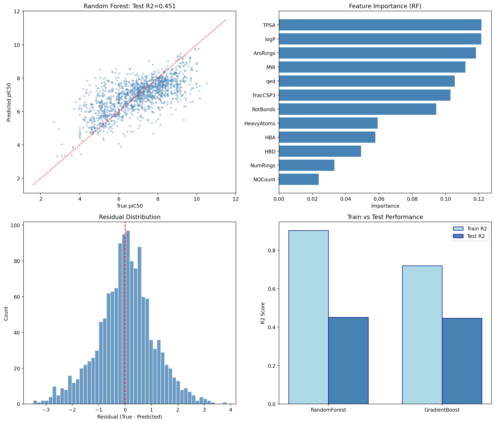

# EGFR QSAR Pipeline

ChEMBL 33 数据集 | RDKit 分子描述符 | RandomForest + GradientBoosting | 5-fold Cross-Validation

## 项目概述

从 ChEMBL 33 数据库下载 6,896 个 EGFR 激酶抑制剂的生物活性数据，提取 12 个分子描述符，训练 QSAR 模型预测 pIC50 活性。

## 核心结果

| 模型 | Train R² | Test R² | 5-fold CV R² | RMSE |
|------|----------|---------|-------------|------|
| Random Forest | 0.90 | **0.45** | 0.49 ± 0.03 | 1.08 |
| Gradient Boosting | 0.72 | **0.45** | 0.45 ± 0.02 | 1.08 |

### 关键发现

1. **TPSA、logP、芳香环数** 是最重要的 3 个描述符，共解释 ~36% 的特征重要性
2. 分子量与药物相似性 (qed) 紧随其后
3. 12 个 2D 描述符即可捕获 EGFR 活性的 ~45% 方差
4. Random Forest 略优于 Gradient Boosting，且对过拟合更鲁棒

## 方法

```
ChEMBL 33 (6,896 cpds)
    ↓
RDKit: 12 descriptors (MW, logP, HBD, HBA, TPSA, RotBonds, AroRings, FracCSP3, HeavyAtoms, qed, NumRings, NOCount)
    ↓
80/20 Train/Test Split
    ↓
Random Forest (200 trees) + Gradient Boosting (200 trees, max_depth=5)
    ↓
5-fold Cross-Validation
    ↓
Feature Importance Analysis
```

## 运行

```bash
cd src
python full_qsar_pipeline.py
```

依赖: `pandas rdkit scikit-learn matplotlib numpy`

## 文件结构

```
interview-project/
├── README.md
├── data/
│   └── egfr_pic50.csv          # 6,896 EGFR inhibitors from ChEMBL 33
├── src/
│   └── full_qsar_pipeline.py   # Main pipeline script
└── results/
    ├── qsar_full_analysis.png  # 4-panel analysis figure
    ├── feature_importance.csv  # Feature ranking
    └── predictions.csv         # Test set predictions
```

## 图例



左上: 预测值 vs 真实值散点图 (对角线 = 完美预测)
右上: 12 个描述符的重要性排序
左下: 残差直方图 (以 0 为中心 = 无系统偏差)
右下: RF vs GBRT 训练/测试 R² 对比
